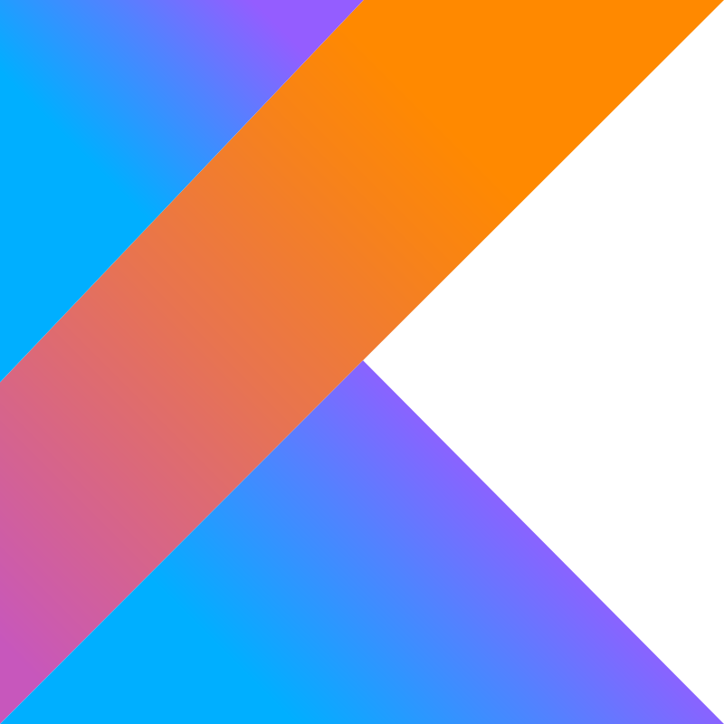

<div>
  <h1 align="center"><a href="https://www.codewars.com/">Codewars</a></h1>
  
</div>

<br>

Codewars is a platform where software developers train on **coding challenges** known as *kata*. These discrete programming exercises train a range of skills in a variety of programming languages, and are completed within an online integrated development environment.

<br>

Katas are ranked by difficulty, and users progress through the ranks by completing kata at or above their current rank. The user's rank is determined by the number of kata they have completed and the number of kata they have authored.

<br>

<!-- TODO image of the ranking system -->

<br>

## Example 3kyu Kata

### [**Screen Locking Patterns**](https://www.codewars.com/kata/585894545a8a07255e0002f1)

You might already be familiar with many smartphones that allow you to use a geometric pattern as a security measure. To unlock the device, you need to connect a sequence of dots/points in a grid by swiping your finger without lifting it as you trace the pattern through the screen.

The image below has an example pattern of 7 dots/points: (A -> B -> I -> E -> D -> G -> C).


For this kata, your job is to implement a function that returns **the number of possible patterns starting from a given first point, that have a given length.**

Get more information of the kata in this [link](./3kyu/screen_locking_patterns/README.md).

**My Solution:**

```python
def permutations(s):
    if len(s) == 1: return s
    final = []
    for i in range(len(s)):
        m = s[i]
        rest = s[:i]+s[i+1:]
        for y in permutations(rest):
            final.append(m+y)
    return final

def count_patterns_from(firstPoint, length):
    strings = "ABCDEFGHI"
    jumps   = {
        "AC":"B","AG":"D","AI":"E",
        "GA":"D","GI":"H","GC":"E",
        "IC":"F","IG":"H","IA":"E",
        "CA":"B","CI":"F","CG":"E",
        "DF":"E","BH":"E","FD":"E",
        "HB":"E"
    }
    # Base cases
    if length>=10 or length<=0: return 0
    if length == 1: return 1

    all = permutations(strings.replace(firstPoint,""))
    for x in range(len(all)):
        all[x] = firstPoint + all[x][:length-1]
    all = set(all)
    patterns = []
    for j in all:
        st = "possible"
        if len(j) == 2:
            if j not in jumps: patterns.append(j)
        
        if len(j)>2:
            for x in range(0,len(j)-1):
                if j[x:x+2] in jumps:
                    if j.find(jumps[j[x:x+2]])==-1 or j.find(jumps[j[x:x+2]])>j.find(j[x:x+2]): 
                        st = "impossible"
                        break
            if st == "possible":
                patterns.append(j)

    return len(set(patterns))
```

### Profile
These are the languages I have trained on:

<div class="languages" style="display: flex; gap: 20px; align-items: center; justify-content: center;">
    
    
    
    
</div>

<br>
<br>

And this is my badge

<p align="center">
  <a href="https://www.codewars.com">
    
  </a>
</p>
